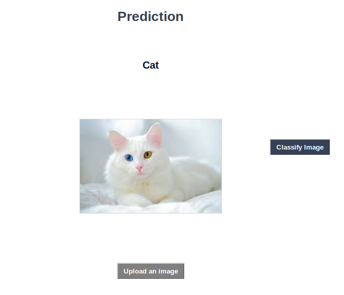
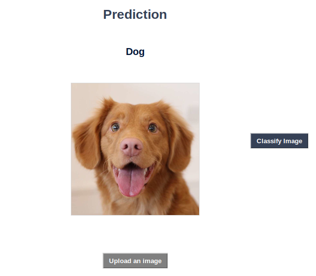
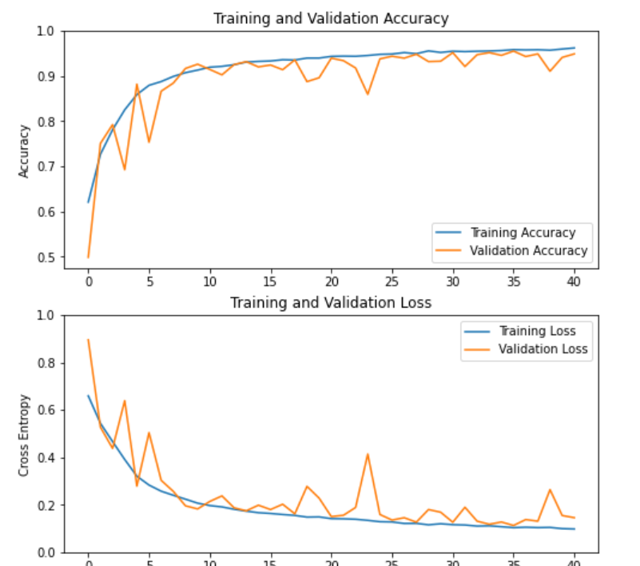

# Goal
The goal was to train a classifier that would be able to make difference between cats and dogs.
In this project, I have created a GUI interface on which we can insert a picture and classify it.

# GUI

# Results

